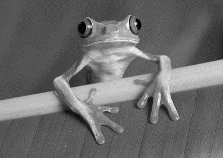
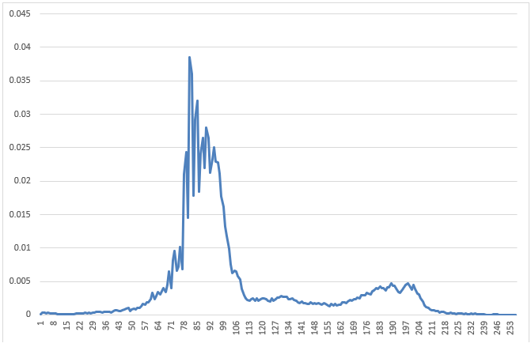
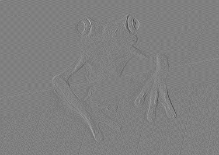
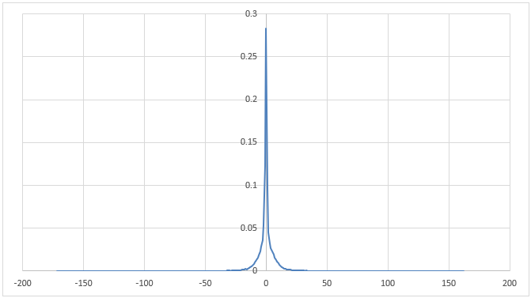

# HuffDiff

> **Multimedia data processing**
>
> Data: *2026-04-27*

Inspired by the JPEG standard, the following lossless image compression format is defined:

| Field         | Size                                                                  | Description                                    |
| :------------ | :-------------------------------------------------------------------- | :--------------------------------------------- |
| Magic Number  | 8 byte                                                                | "HUFFDIFF"                                     |
| Width         | Unsigned 32 bits little endian integer                                | Width in pixel                                 |
| Height        | Unsigned 32 bits little endian integer                                | Height in pixel                                |
| NumElement    | Unsigned 9 bits integer                                               | Number of items in the following Huffman table |
| Huffman Table | NumElement couples (unsigned 9 bits integer, unsigned 5 bits integer) | Table of symbol pairs and length of Huffman codes: the length of the Huffman code is specified for each possible symbol. The table must already be ordered by increasing lengths and the canonical codes will be generated starting from 0 and keeping the order specified in the table. |
| Data          | Variable                                                              | Values of the difference matrix, coded with the canonical Huffman codes, according to the previous table. |

The difference matrix (D) refers to the image constructed from the original image (I), according to the following rules:

- Element D(0, 0) is the value of pixel I(0, 0)
- Elements D(0, y) are computed as I(0, y) - I(0, y - 1), with y > 0
- Elements D(x, y) are computed as I(x, y) - I(x - 1, y), with x > 0

For example the following image I:

| a    | b    | c    | d    |
| :--- | :--- | :--- | :--- |
| e    | f    | g    | h    |
| i    | j    | k    | l    |
| m    | n    | o    | p    |

Will produce the difference image D:

| a    | b-a  | c-b  | d-c  |
| :--- | :--- | :--- | :--- |
| e-a  | f-e  | g-f  | h-g  |
| i-e  | j-i  | k-j  | l-k  |
| m-i  | n-m  | o-n  | p-o  |

Write a command line program that accepts three parameters:

```bash
huffdiff [c|d] <input file> <output file>
```

1. A command: "c" for "compress", "d" for "decompress"
2. The name of an input file (grayscale PAM for compression, HUFFDIFF for decompression)
3. The name of an output file (HUFFDIFF for compression, grayscale PAM for decompression)

Properly handle any errors on the command line and in cases where the input file cannot be opened or the output file already exists.

During compression, the program must read the input image and save it in output in the HUFFDIFF format, while in decompression it must perform the reverse operation.

The format involves calculating the difference matrix (which cannot be stored in uint8_t), calculating the difference frequencies, finding the lengths of the Huffman codes, generating the canonical codes and then saving according to the previous rules.

For example, consider the FROG_BIN.PAM file:



The distribution of gray levels for this image is as follows:



This corresponds to a set of symbols from 0 to 255, with entropy equal to approximately 6.7. On the other hand, if we calculate the difference matrix, things change considerably.

To have a viewable version of the difference matrix, it is possible to apply a transformation that takes the values from the range [-255,255] to the range [0,255] with the 0 being value 128. The image thus obtained looks as follows:



Also visually, it is clear that most of the values are close to zero (128 in the displayed version). The distribution of values for this matrix is as follows:



The entropy in this case becomes about 4.2. The compressed file in the format indicated in the exercise becomes approximately 51.8 KB, compared to the original 97.4 KB of the original PAM file.

I suggest you to first generate a difference matrix, then create and save the output image to visualize the result. Finally, using the original difference matrix (whose pixels values cannot be stored in uint8_t) save the data in the specified file format.
